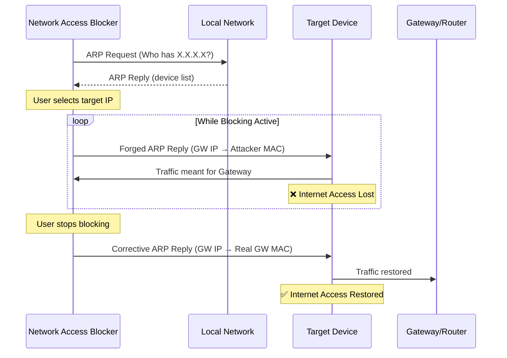

<p align="center">
  
  
  
  
  
</p>

<h1 align="center">🛡️ Network Access Blocker</h1>

<p align="center">
  <strong>ARP-based network access control tool with real-time device detection and an intuitive GUI.</strong><br>
  Built for ethical security testing, network auditing, and educational purposes.
</p>

---

> [!CAUTION]
> **LEGAL DISCLAIMER — READ BEFORE USE**
>
> This tool performs **ARP Spoofing**, a technique that manipulates network traffic at the data-link layer.
> Unauthorized use of this tool on networks you do not own or do not have explicit written permission to test
> is **illegal** in most jurisdictions and may result in criminal prosecution.
>
> The authors assume **no liability** for any misuse, damage, or legal consequences resulting from the use of this software.
> **Use exclusively in controlled lab environments or with written authorization from the network owner.**

---

## 📑 Table of Contents

- [Features](#-features)
- [How It Works](#-how-it-works)
- [Architecture](#-architecture)
- [Requirements](#-requirements)
- [Installation](#-installation)
- [Usage](#-usage)
- [Project Structure](#-project-structure)
- [Contributing](#-contributing)
- [License](#-license)

---

## ✨ Features

| Feature | Description |
|---|---|
| 🔍 **Auto Network Scan** | Discovers all active devices on your local network via ARP requests |
| 🌐 **Auto Gateway Detection** | Automatically identifies your router/gateway IP address |
| 🎯 **Targeted Blocking** | Block internet access for specific devices by IP address |
| 🖥️ **Modern Dark GUI** | Intuitive graphical interface built with CustomTkinter |
| ⚡ **Real-time Control** | Instant block/unblock with live status feedback |
| 🔄 **ARP Table Restoration** | Properly restores ARP tables when blocking is stopped |
| 🛡️ **Privilege Verification** | Checks for administrator/root privileges before execution |
| 📋 **Structured Logging** | Timestamped logs for auditing and debugging |
| 🔁 **Network Re-scan** | Re-scan the network at any time without restarting |

---

## 🧠 How It Works

This tool leverages **ARP Spoofing** (ARP Cache Poisoning) to disrupt the connection between a target device and the network gateway:

1. **Discovery** — The tool sends ARP requests across the local subnet to identify active hosts and their MAC addresses.
2. **Spoofing** — It sends forged ARP reply packets to the target device, claiming that the attacker's MAC address belongs to the gateway (router).
3. **Disruption** — The target device updates its ARP cache with the false mapping, causing it to send all outgoing traffic to the attacker instead of the real gateway, effectively cutting off its internet access.
4. **Restoration** — When blocking is stopped, the tool sends corrective ARP packets with the real gateway MAC address to restore normal connectivity.

> [!NOTE]
> ARP operates at **Layer 2** (Data Link Layer) of the OSI model. This technique only works within the same broadcast domain (local network segment). It does not affect devices on different subnets or VLANs.

---

## 🏗️ Architecture



---

## 📋 Requirements

### System Requirements

| Requirement | Details |
|---|---|
| **Python** | 3.8 or higher |
| **OS** | Windows 10/11 or Linux (Debian/Ubuntu/Arch) |
| **Privileges** | Administrator (Windows) / Root (Linux) |
| **Network** | Must be connected to the target LAN |

### Windows-Specific

- **[Npcap](https://nmap.org/npcap/)** — Required for raw packet capture. Download and install with **"WinPcap API-compatible Mode"** enabled during setup.

### Python Dependencies

| Package | Purpose |
|---|---|
| `scapy` | Packet crafting and ARP operations |
| `customtkinter` | Modern themed GUI framework |
| `netifaces` | Network interface and gateway detection |

---

## 🔧 Installation

### 1. Clone the Repository

```bash
git clone https://github.com/Jairo-RC/network-access-blocker.git
cd network-access-blocker
```

### 2. Install Python Dependencies

```bash
pip install -r requirements.txt
```

### 3. Platform-Specific Setup

<details>
<summary><strong>🪟 Windows</strong></summary>

1. Download and install **[Npcap](https://nmap.org/npcap/)** (check "WinPcap API-compatible Mode" during installation).
2. Open **PowerShell as Administrator**.
3. Navigate to the project directory and run:

```powershell
python src/ip_block.py
```

</details>

<details>
<summary><strong>🐧 Linux</strong></summary>

1. Ensure `libpcap` is installed:

```bash
# Debian / Ubuntu
sudo apt install libpcap-dev

# Arch Linux
sudo pacman -S libpcap
```

2. Run with root privileges:

```bash
sudo python3 src/ip_block.py
```

</details>

---

## 🚀 Usage

### Quick Start

```bash
# Windows (Admin PowerShell)
python src/ip_block.py

# Linux
sudo python3 src/ip_block.py
```

### Workflow

1. **Launch** — The application opens and automatically scans your local network for active devices.
2. **Select Target** — Choose a device from the dropdown list or manually enter an IP address.
3. **Block** — Click **"⛔ Block Device"** to cut off the target's internet access.
4. **Monitor** — The status indicator shows the current blocking state in real time.
5. **Unblock** — Click **"✅ Restore Access"** to send corrective ARP packets and restore normal connectivity.
6. **Re-scan** — Click **"🔄 Re-scan Network"** at any time to refresh the device list.

> [!TIP]
> If a device doesn't appear in the list, try waiting a few seconds and re-scanning. Some devices respond slowly to ARP requests.

---

## 📁 Project Structure

```
network-access-blocker/
├── src/
│   └── ip_block.py          # Main application (GUI + ARP logic)
├── requirements.txt          # Python dependencies
├── .gitignore                # Git ignore rules
├── LICENSE                   # MIT License
└── README.md                 # This file
```

---

## 🤝 Contributing

Contributions are welcome! If you'd like to improve this project:

1. **Fork** the repository
2. **Create** a feature branch: `git checkout -b feature/your-feature`
3. **Commit** your changes: `git commit -m "Add: your feature description"`
4. **Push** to the branch: `git push origin feature/your-feature`
5. **Open** a Pull Request

### Ideas for Contribution

- [ ] Multi-target simultaneous blocking
- [ ] Network traffic monitoring dashboard
- [ ] Packet logging and export (PCAP format)
- [ ] Scheduled blocking (time-based rules)
- [ ] Detection evasion improvements

---

## 📜 License

This project is licensed under the **MIT License** — see the [LICENSE](LICENSE) file for details.

---

<p align="center">
  <strong>Built for learning. Use responsibly. 🛡️</strong><br>
  <sub>Made with ❤️ by <a href="https://github.com/Jairo-RC">Jairo RC</a></sub>
</p>
