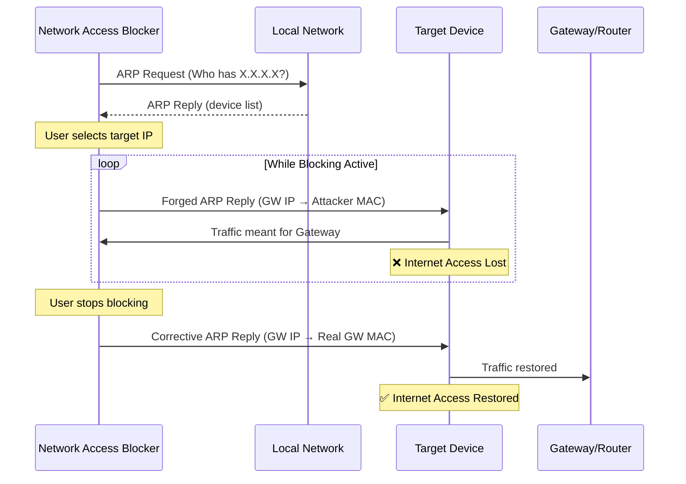

<p align="center">
  
  
  
  
  
</p>

<h1 align="center">🛡️ Network Access Blocker</h1>

<p align="center">
  <strong>ARP-based network access control tool with real-time device detection and an intuitive GUI.</strong><br>
  Built for ethical security testing, network auditing, and educational purposes.
</p>

---

> [!CAUTION]
> **LEGAL DISCLAIMER — READ BEFORE USE**
>
> This tool performs **ARP Spoofing**, a technique that manipulates network traffic at the data-link layer.
> Unauthorized use of this tool on networks you do not own or do not have explicit written permission to test
> is **illegal** in most jurisdictions and may result in criminal prosecution.
>
> The authors assume **no liability** for any misuse, damage, or legal consequences resulting from the use of this software.
> **Use exclusively in controlled lab environments or with written authorization from the network owner.**

---

## 📑 Table of Contents

- [Features](#-features)
- [How It Works](#-how-it-works)
- [Architecture](#-architecture)
- [Requirements](#-requirements)
- [Installation on Debian / Kali / Ubuntu](#-installation-on-debian--kali--ubuntu)
- [Running the Application](#-running-the-application)
- [Common Issues](#-common-issues)
- [Project Structure](#-project-structure)
- [Contributing](#-contributing)
- [License](#-license)

---

## ✨ Features

| Feature | Description |
|---|---|
| 🔍 **Auto Network Scan** | Discovers all active devices on your local network via ARP requests |
| 🌐 **Auto Gateway Detection** | Automatically identifies your router/gateway IP address |
| 🎯 **Targeted Blocking** | Block internet access for specific devices by IP address |
| 🖥️ **Modern Dark GUI** | Intuitive graphical interface built with CustomTkinter |
| ⚡ **Real-time Control** | Instant block/unblock with live status feedback |
| 🔄 **ARP Table Restoration** | Properly restores ARP tables when blocking is stopped |
| 🛡️ **Privilege Verification** | Checks for administrator/root privileges before execution |
| 📋 **Structured Logging** | Timestamped logs for auditing and debugging |
| 🔁 **Network Re-scan** | Re-scan the network at any time without restarting |

---

## 🧠 How It Works

This tool leverages **ARP Spoofing** (ARP Cache Poisoning) to disrupt the connection between a target device and the network gateway:

1. **Discovery** — The tool sends ARP requests across the local subnet to identify active hosts and their MAC addresses.
2. **Spoofing** — It sends forged ARP reply packets to the target device, claiming that the attacker's MAC address belongs to the gateway (router).
3. **Disruption** — The target device updates its ARP cache with the false mapping, causing it to send all outgoing traffic to the attacker instead of the real gateway, effectively cutting off its internet access.
4. **Restoration** — When blocking is stopped, the tool sends corrective ARP packets with the real gateway MAC address to restore normal connectivity.

> [!NOTE]
> ARP operates at **Layer 2** (Data Link Layer) of the OSI model. This technique only works within the same broadcast domain (local network segment). It does not affect devices on different subnets or VLANs.

---

## 🏗️ Architecture



---

## 📋 Requirements

Recommended system:

- Debian
- Kali Linux
- Ubuntu
- Python 3
- Virtual environment `.venv`
- Administrator privileges for network operations

---

## 🔧 Installation on Debian / Kali / Ubuntu

First, install the base system dependencies:

```bash
sudo apt update
sudo apt install python3-full python3-venv python3-pip python3-tk net-tools iproute2 tcpdump arping libpcap-dev -y
```

Clone the repository:

```bash
cd ~/Apps
git clone https://github.com/Jairo-RC/network-access-blocker.git
cd network-access-blocker
```

---

## 📦 Create virtual environment

Do not install dependencies directly on the system's Python.

Create a virtual environment:

```bash
python3 -m venv .venv
```

Activate it:

```bash
source .venv/bin/activate
```

Upgrade `pip`:

```bash
pip install --upgrade pip
```

Install the project dependencies:

```bash
pip install -r requirements.txt
```

---

## 🛡️ Fix for externally-managed-environment error

On recent versions of Debian, Kali, and Ubuntu, you might see this error:

```bash
error: externally-managed-environment
```

This occurs because the system protects the global Python environment to prevent damage to system dependencies.

The correct solution is to use a virtual environment:

```bash
python3 -m venv .venv
source .venv/bin/activate
pip install -r requirements.txt
```

It is not recommended to use:

```bash
pip install --break-system-packages
```

as it can break system packages.

---

## 🔍 Verify dependencies

To confirm that `customtkinter` is installed correctly:

```bash
.venv/bin/python -c "import customtkinter; print('customtkinter OK')"
```

If a `tkinter` related error appears, install:

```bash
sudo apt install python3-tk -y
```

---

## 🚀 Running the application

Run the app using the virtual environment's Python:

```bash
sudo .venv/bin/python src/ip_block.py
```

Do not use:

```bash
sudo python3 src/ip_block.py
```

That command uses the global system Python and can generate errors such as:

```bash
ModuleNotFoundError: No module named 'customtkinter'
```

---

## ⚙️ Create a global command

You can create a command to start the app from any terminal.

Create the file:

```bash
sudo nano /usr/local/bin/network-access-blocker
```

Paste this content:

```bash
#!/bin/bash
cd /home/jrc/Apps/network-access-blocker || exit
sudo /home/jrc/Apps/network-access-blocker/.venv/bin/python src/ip_block.py
```

Save with:

```text
CTRL + O
ENTER
CTRL + X
```

Assign permissions:

```bash
sudo chmod +x /usr/local/bin/network-access-blocker
```

Now you can start the application with:

```bash
network-access-blocker
```

---

## 📅 Daily use

Whenever you want to start the app:

```bash
network-access-blocker
```

Or manually:

```bash
cd ~/Apps/network-access-blocker
source .venv/bin/activate
sudo .venv/bin/python src/ip_block.py
```

---

## 🐛 Common issues

### Error: No module named 'customtkinter'

Probable cause:

The app was executed with the global Python:

```bash
sudo python3 src/ip_block.py
```

Solution:

```bash
sudo .venv/bin/python src/ip_block.py
```

---

### Error: externally-managed-environment

Probable cause:

Attempted to install packages with `pip` directly to the system's Python.

Solution:

```bash
python3 -m venv .venv
source .venv/bin/activate
pip install -r requirements.txt
```

---

### Error related to tkinter

Install the system package:

```bash
sudo apt install python3-tk -y
```

---

### The global command does not work

Verify that the file exists:

```bash
ls -l /usr/local/bin/network-access-blocker
```

Verify permissions:

```bash
sudo chmod +x /usr/local/bin/network-access-blocker
```

Verify the project path:

```bash
ls /home/jrc/Apps/network-access-blocker
```

If your username or path is different, edit the file:

```bash
sudo nano /usr/local/bin/network-access-blocker
```

---

## ⚖️ Responsible use

This tool should only be used on networks you own, in laboratories, or in environments where you have authorization.

It must not be used to affect networks, equipment, or users without permission.

---

## 📁 Project Structure

```
network-access-blocker/
├── src/
│   └── ip_block.py          # Main application (GUI + ARP logic)
├── requirements.txt          # Python dependencies
├── .gitignore                # Git ignore rules
├── LICENSE                   # MIT License
└── README.md                 # This file
```

---

## 🤝 Contributing

Contributions are welcome! If you'd like to improve this project:

1. **Fork** the repository
2. **Create** a feature branch: `git checkout -b feature/your-feature`
3. **Commit** your changes: `git commit -m "Add: your feature description"`
4. **Push** to the branch: `git push origin feature/your-feature`
5. **Open** a Pull Request

### Ideas for Contribution

- [ ] Multi-target simultaneous blocking
- [ ] Network traffic monitoring dashboard
- [ ] Packet logging and export (PCAP format)
- [ ] Scheduled blocking (time-based rules)
- [ ] Detection evasion improvements

---

## 📜 License

This project is licensed under the **MIT License** — see the [LICENSE](LICENSE) file for details.

---

<p align="center">
  <strong>Built for learning. Use responsibly. 🛡️</strong><br>
  <sub>Made with ❤️ by <a href="https://github.com/Jairo-RC">Jairo RC</a></sub>
</p>
